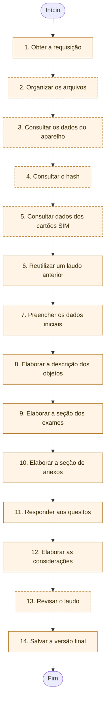
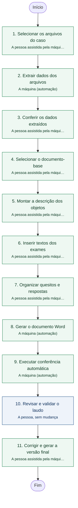

# Fluxogramas do processo · agiliza-mais

Gerados a partir de `projeto.json`. As setas seguem a ordem da tabela.

## AS-IS

```mermaid
%% Fluxograma ASIS · 14 etapas
flowchart TD
  IN(["Início"])
  N1["1. Obter a requisição"]:::manual
  N2["2. Organizar os arquivos"]:::wait
  N3["3. Consultar os dados do aparelho"]:::wait
  N4["4. Consultar o hash"]:::wait
  N5["5. Consultar dados dos cartões SIM"]:::wait
  N6["6. Reutilizar um laudo anterior"]:::manual
  N7["7. Preencher os dados iniciais"]:::manual
  N8["8. Elaborar a descrição dos objetos"]:::manual
  N9["9. Elaborar a seção dos exames"]:::manual
  N10["10. Elaborar a seção de anexos"]:::manual
  N11["11. Responder aos quesitos"]:::manual
  N12["12. Elaborar as considerações"]:::manual
  N13["13. Revisar o laudo"]:::wait
  N14["14. Salvar a versão final"]:::manual
  FIM(["Fim"])
  IN --> N1
  N1 --> N2
  N2 --> N3
  N3 --> N4
  N4 --> N5
  N5 --> N6
  N6 --> N7
  N7 --> N8
  N8 --> N9
  N9 --> N10
  N10 --> N11
  N11 --> N12
  N12 --> N13
  N13 --> N14
  N14 --> FIM
  classDef manual fill:#fff4e5,stroke:#a35f00,color:#3b2a00;
  classDef wait fill:#fff4e5,stroke:#a35f00,stroke-dasharray:5 3,color:#3b2a00;
  classDef auto fill:#eef8f2,stroke:#127a45,color:#0b3b23;
  classDef humano fill:#eef3fa,stroke:#12487f,color:#0a2f5c;
```

## TO-BE

```mermaid
%% Fluxograma TOBE · 11 etapas
flowchart TD
  IN(["Início"])
  N1["1. Selecionar os arquivos do caso<br/><small>A pessoa assistida pela máqui…</small>"]:::auto
  N2["2. Extrair dados dos arquivos<br/><small>A máquina (automação)</small>"]:::auto
  N3["3. Conferir os dados extraídos<br/><small>A pessoa assistida pela máqui…</small>"]:::auto
  N4["4. Selecionar o documento-base<br/><small>A pessoa assistida pela máqui…</small>"]:::auto
  N5["5. Montar a descrição dos objetos<br/><small>A pessoa assistida pela máqui…</small>"]:::auto
  N6["6. Inserir textos dos exames<br/><small>A pessoa assistida pela máqui…</small>"]:::auto
  N7["7. Organizar quesitos e respostas<br/><small>A pessoa assistida pela máqui…</small>"]:::auto
  N8["8. Gerar o documento Word<br/><small>A máquina (automação)</small>"]:::auto
  N9["9. Executar conferência automática<br/><small>A máquina (automação)</small>"]:::auto
  N10["10. Revisar e validar o laudo<br/><small>A pessoa, sem mudança</small>"]:::humano
  N11["11. Corrigir e gerar a versão final<br/><small>A pessoa assistida pela máqui…</small>"]:::auto
  FIM(["Fim"])
  IN --> N1
  N1 --> N2
  N2 --> N3
  N3 --> N4
  N4 --> N5
  N5 --> N6
  N6 --> N7
  N7 --> N8
  N8 --> N9
  N9 --> N10
  N10 --> N11
  N11 --> FIM
  classDef manual fill:#fff4e5,stroke:#a35f00,color:#3b2a00;
  classDef wait fill:#fff4e5,stroke:#a35f00,stroke-dasharray:5 3,color:#3b2a00;
  classDef auto fill:#eef8f2,stroke:#127a45,color:#0b3b23;
  classDef humano fill:#eef3fa,stroke:#12487f,color:#0a2f5c;
```
