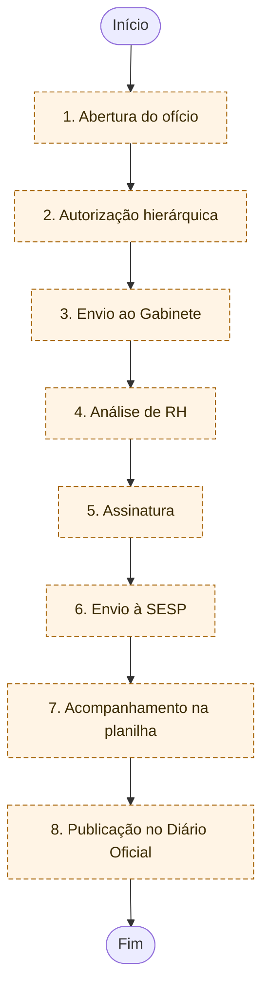
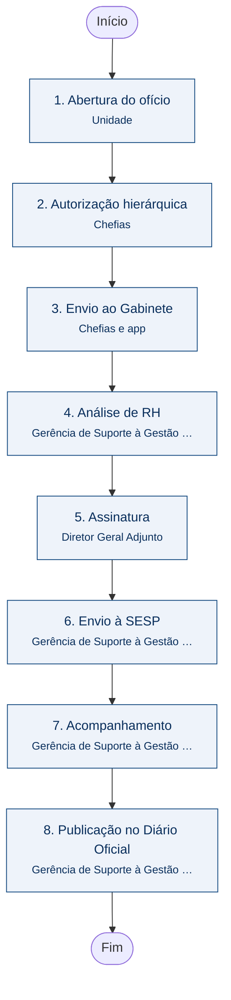

# Fluxogramas do processo · evento-substituicao-temporaria

Gerados a partir de `projeto.json` (as setas seguem a ordem da tabela) ou de `*.manual.mmd`, quando existe.

## AS-IS

```mermaid
%% Fluxograma ASIS · 8 etapas
flowchart TD
  IN(["Início"])
  N1["1. Abertura do ofício"]:::wait
  N2["2. Autorização hierárquica"]:::wait
  N3["3. Envio ao Gabinete"]:::wait
  N4["4. Análise de RH"]:::wait
  N5["5. Assinatura"]:::wait
  N6["6. Envio à SESP"]:::wait
  N7["7. Acompanhamento na planilha"]:::wait
  N8["8. Publicação no Diário Oficial"]:::wait
  FIM(["Fim"])
  IN --> N1
  N1 --> N2
  N2 --> N3
  N3 --> N4
  N4 --> N5
  N5 --> N6
  N6 --> N7
  N7 --> N8
  N8 --> FIM
  classDef manual fill:#fff4e5,stroke:#a35f00,color:#3b2a00;
  classDef wait fill:#fff4e5,stroke:#a35f00,stroke-dasharray:5 3,color:#3b2a00;
  classDef auto fill:#eef8f2,stroke:#127a45,color:#0b3b23;
  classDef humano fill:#eef3fa,stroke:#12487f,color:#0a2f5c;
```

## TO-BE

```mermaid
%% Fluxograma TOBE · 8 etapas
flowchart TD
  IN(["Início"])
  N1["1. Abertura do ofício<br/><small>Unidade</small>"]:::humano
  N2["2. Autorização hierárquica<br/><small>Chefias</small>"]:::humano
  N3["3. Envio ao Gabinete<br/><small>Chefias e app</small>"]:::humano
  N4["4. Análise de RH<br/><small>Gerência de Suporte à Gestão …</small>"]:::humano
  N5["5. Assinatura<br/><small>Diretor Geral Adjunto</small>"]:::humano
  N6["6. Envio à SESP<br/><small>Gerência de Suporte à Gestão …</small>"]:::humano
  N7["7. Acompanhamento<br/><small>Gerência de Suporte à Gestão …</small>"]:::humano
  N8["8. Publicação no Diário Oficial<br/><small>Gerência de Suporte à Gestão …</small>"]:::humano
  FIM(["Fim"])
  IN --> N1
  N1 --> N2
  N2 --> N3
  N3 --> N4
  N4 --> N5
  N5 --> N6
  N6 --> N7
  N7 --> N8
  N8 --> FIM
  classDef manual fill:#fff4e5,stroke:#a35f00,color:#3b2a00;
  classDef wait fill:#fff4e5,stroke:#a35f00,stroke-dasharray:5 3,color:#3b2a00;
  classDef auto fill:#eef8f2,stroke:#127a45,color:#0b3b23;
  classDef humano fill:#eef3fa,stroke:#12487f,color:#0a2f5c;
```
