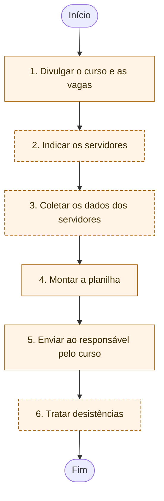
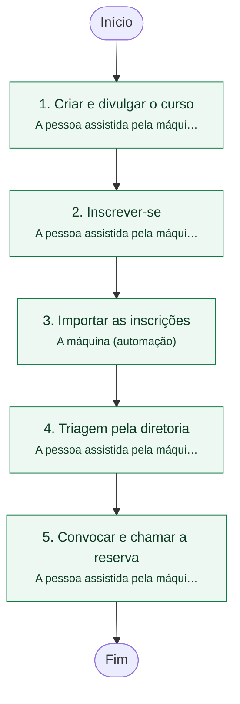

# Fluxogramas do processo · inscricoes-cursos

Gerados a partir de `projeto.json`. As setas seguem a ordem da tabela.

## AS-IS

```mermaid
%% Fluxograma ASIS · 6 etapas
flowchart TD
  IN(["Início"])
  N1["1. Divulgar o curso e as vagas"]:::manual
  N2["2. Indicar os servidores"]:::wait
  N3["3. Coletar os dados dos servidores"]:::wait
  N4["4. Montar a planilha"]:::manual
  N5["5. Enviar ao responsável pelo curso"]:::manual
  N6["6. Tratar desistências"]:::wait
  FIM(["Fim"])
  IN --> N1
  N1 --> N2
  N2 --> N3
  N3 --> N4
  N4 --> N5
  N5 --> N6
  N6 --> FIM
  classDef manual fill:#fff4e5,stroke:#a35f00,color:#3b2a00;
  classDef wait fill:#fff4e5,stroke:#a35f00,stroke-dasharray:5 3,color:#3b2a00;
  classDef auto fill:#eef8f2,stroke:#127a45,color:#0b3b23;
  classDef humano fill:#eef3fa,stroke:#12487f,color:#0a2f5c;
```

## TO-BE

```mermaid
%% Fluxograma TOBE · 5 etapas
flowchart TD
  IN(["Início"])
  N1["1. Criar e divulgar o curso<br/><small>A pessoa assistida pela máqui…</small>"]:::auto
  N2["2. Inscrever-se<br/><small>A pessoa assistida pela máqui…</small>"]:::auto
  N3["3. Importar as inscrições<br/><small>A máquina (automação)</small>"]:::auto
  N4["4. Triagem pela diretoria<br/><small>A pessoa assistida pela máqui…</small>"]:::auto
  N5["5. Convocar e chamar a reserva<br/><small>A pessoa assistida pela máqui…</small>"]:::auto
  FIM(["Fim"])
  IN --> N1
  N1 --> N2
  N2 --> N3
  N3 --> N4
  N4 --> N5
  N5 --> FIM
  classDef manual fill:#fff4e5,stroke:#a35f00,color:#3b2a00;
  classDef wait fill:#fff4e5,stroke:#a35f00,stroke-dasharray:5 3,color:#3b2a00;
  classDef auto fill:#eef8f2,stroke:#127a45,color:#0b3b23;
  classDef humano fill:#eef3fa,stroke:#12487f,color:#0a2f5c;
```
