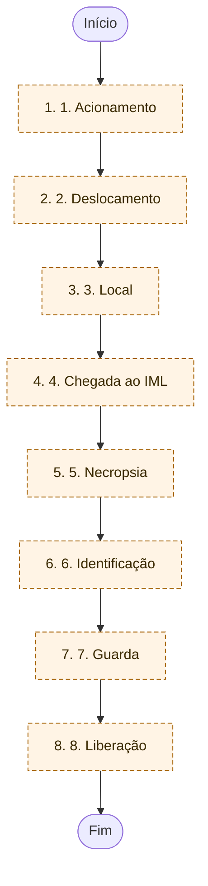

# Fluxogramas do processo · trilha-custodia-necropsia

Gerados a partir de `projeto.json` (as setas seguem a ordem da tabela) ou de `*.manual.mmd`, quando existe.

## AS-IS

```mermaid
%% Fluxograma ASIS · 8 etapas
flowchart TD
  IN(["Início"])
  N1["1. 1. Acionamento"]:::wait
  N2["2. 2. Deslocamento"]:::wait
  N3["3. 3. Local"]:::wait
  N4["4. 4. Chegada ao IML"]:::wait
  N5["5. 5. Necropsia"]:::wait
  N6["6. 6. Identificação"]:::wait
  N7["7. 7. Guarda"]:::wait
  N8["8. 8. Liberação"]:::wait
  FIM(["Fim"])
  IN --> N1
  N1 --> N2
  N2 --> N3
  N3 --> N4
  N4 --> N5
  N5 --> N6
  N6 --> N7
  N7 --> N8
  N8 --> FIM
  classDef manual fill:#fff4e5,stroke:#a35f00,color:#3b2a00;
  classDef wait fill:#fff4e5,stroke:#a35f00,stroke-dasharray:5 3,color:#3b2a00;
  classDef auto fill:#eef8f2,stroke:#127a45,color:#0b3b23;
  classDef humano fill:#eef3fa,stroke:#12487f,color:#0a2f5c;
```

## TO-BE

```mermaid
%% Fluxograma TO-BE · Sistema de Controle de Necropsia
%% Revisão do fluxograma da Silmara Bueno (05/11/2026). Três perfis: Técnico, Médico Legista e Gestor ADM.
flowchart LR
  A["Etapa 1<br/>Acionamento<br/><small>Técnico</small>"]:::humano --> B["Etapa 2<br/>Ocorrência e possível vítima<br/><small>Técnico</small>"]:::humano
  B --> C["Etapa 3<br/>Aguardando necropsia"]:::auto --> D["Etapa 4<br/>Necropsia<br/><small>Médico Legista e Técnico</small>"]:::humano
  D --> L["Lacres coletados<br/><small>Técnico</small>"]:::humano --> LR{"ADM confirmou<br/>o recebimento?<br/><small>Gestor ADM</small>"}
  D --> E["Etapa 5<br/>Necropapiloscopia"]:::humano
  E --> E1{"Identificou?"}
  E1 -- Não --> E6["Exame complementar<br/>DNA, odontologia legal<br/>ou antropologia"]:::humano --> E7{"Identificou?"}
  E7 -- "Não, outro exame" --> E6
  E7 -- "Não, métodos esgotados" --> J["Decisão do Gestor ADM<br/>justificativa de 20+ caracteres"]:::humano
  E1 -- Sim --> F
  E7 -- Sim --> F["Etapa 6<br/>Busca de familiares<br/><small>Técnico</small>"]:::humano
  F --> F1{"Familiar<br/>localizado?"}
  F1 -- Sim --> F2["Termo de liberação<br/>assinado no app"]:::auto --> FUN
  F1 -- "Não, prazo esgotado" --> J
  J --> AUT["Autorização de<br/>sepultamento pelo Estado"]:::humano --> FUN["Funerária<br/>Auto de Entrega"]:::humano
  D --> G["Laudo entregue à ADM<br/>corre em paralelo"]:::humano --> GR{"ADM confirmou<br/>o laudo?<br/><small>Gestor ADM</small>"}
  FUN --> H{"Destino + laudo +<br/>lacres confirmados?"}
  GR -- Sim --> H
  LR -- Sim --> H
  H -- Sim --> FIM(["Etapa 7<br/>Custódia finalizada"]):::auto
  FIM -. "correção ou familiar<br/>após o sepultamento" .-> RET["Retificação<br/>nova entrada no histórico"]:::auto
  classDef manual fill:#fff4e5,stroke:#a35f00,color:#3b2a00;
  classDef wait fill:#fff4e5,stroke:#a35f00,stroke-dasharray:5 3,color:#3b2a00;
  classDef auto fill:#eef8f2,stroke:#127a45,color:#0b3b23;
  classDef humano fill:#eef3fa,stroke:#12487f,color:#0a2f5c;
```
